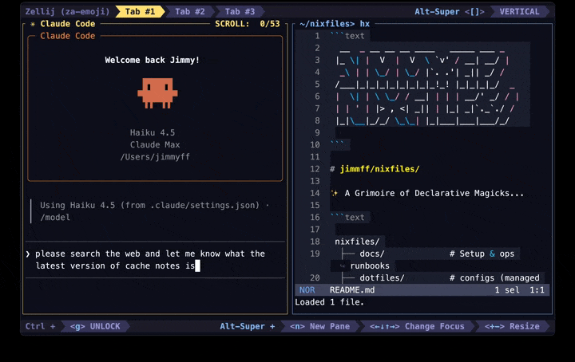

# zellij-attention

Know which Zellij tab needs your attention — without checking each one.



Forked from **[KiryuuLight/zellij-attention](https://github.com/KiryuuLight/zellij-attention)**, reworked & maintained by **[jimmyff](https://www.jimmyff.co.uk/)** — a 2-state indicator turned into a 3-state, priority-based one with reliable clearing.

A standalone Zellij WASM plugin that appends a status icon to a tab's name when an external process (like Claude Code) changes state — e.g. `terminal` becomes `terminal ⏳`. Works with the default tab bar and [zjstatus](https://github.com/dj95/zjstatus); loads in the background with no visible pane.

## States

| Icon | State | Meaning |
| --- | --- | --- |
| 🚨 | attention | needs you (e.g. a permission prompt) |
| ⏳ | working | actively working |
| ✅ | done | finished — clears when you focus the tab |

A tab with several panes shows the highest priority (`attention` > `working` > `done`). `attention`/`working` persist regardless of focus; `done` clears when you focus the tab. Icons are configurable — use any character or emoji (e.g. plain `!` / `▶` / `✓`).

## Install

Grab the latest wasm and point your config at it:

```bash
mkdir -p ~/.config/zellij/plugins
curl -L https://github.com/jimmyff/zellij-attention/releases/latest/download/zellij-attention.wasm \
  -o ~/.config/zellij/plugins/zellij-attention.wasm
```

Or build from source — `nix build` (or `cargo build --release`), then copy `target/wasm32-wasip1/release/zellij-attention.wasm` into the plugins dir.

Add to `~/.config/zellij/config.kdl`:

```kdl
load_plugins {
    "file:~/.config/zellij/plugins/zellij-attention.wasm" {
        // all optional — defaults shown
        enabled "true"
        attention_icon "🚨"
        working_icon "⏳"
        done_icon "✅"
    }
}
```

## Pipe interface

Drive it from any process with a broadcast pipe:

```
zellij pipe --name "zellij-attention::VERB::PANE_ID"
```

- `VERB` — `attention`, `working`, `done`, or `clear` (case-insensitive)
- `PANE_ID` — the numeric pane id from `$ZELLIJ_PANE_ID`

> Always use `--name` (broadcast), never `--plugin` (targeted) — a targeted pipe spawns a new plugin instance instead of reaching the running one.

## Claude Code

The plugin only renders what it's told — these [hooks](https://docs.anthropic.com/en/docs/claude-code) are what tell it, so you need **both**: the installed plugin *and* the hooks below. Each command guards on `$ZELLIJ` (a no-op outside Zellij) and ends with `|| true` so a hook never errors.

Add to `~/.claude/settings.json` (merge the `hooks` key if you already have one):

```json
{
  "hooks": {
    "UserPromptSubmit": [{ "hooks": [{ "type": "command", "command": "sh -c '[ -n \"$ZELLIJ\" ] && zellij pipe --name \"zellij-attention::working::$ZELLIJ_PANE_ID\" || true'" }] }],
    "PreToolUse": [{ "matcher": "", "hooks": [{ "type": "command", "command": "sh -c '[ -n \"$ZELLIJ\" ] && zellij pipe --name \"zellij-attention::working::$ZELLIJ_PANE_ID\" || true'" }] }],
    "PostToolUse": [{ "matcher": "", "hooks": [{ "type": "command", "command": "sh -c '[ -n \"$ZELLIJ\" ] && zellij pipe --name \"zellij-attention::working::$ZELLIJ_PANE_ID\" || true'" }] }],
    "PermissionRequest": [{ "matcher": "", "hooks": [{ "type": "command", "command": "sh -c '[ -n \"$ZELLIJ\" ] && zellij pipe --name \"zellij-attention::attention::$ZELLIJ_PANE_ID\" || true'" }] }],
    "Stop": [{ "hooks": [{ "type": "command", "command": "sh -c '[ -n \"$ZELLIJ\" ] && zellij pipe --name \"zellij-attention::done::$ZELLIJ_PANE_ID\" || true'" }] }],
    "SessionEnd": [{ "hooks": [{ "type": "command", "command": "sh -c '[ -n \"$ZELLIJ\" ] && zellij pipe --name \"zellij-attention::clear::$ZELLIJ_PANE_ID\" || true'" }] }]
  }
}
```

What each event maps to:

| Event | State |
| --- | --- |
| `UserPromptSubmit`, `PreToolUse`, `PostToolUse` | `working` ⏳ |
| `PermissionRequest` | `attention` 🚨 |
| `Stop` | `done` ✅ |
| `SessionEnd` | `clear` |

## Development

```bash
nix develop              # Rust toolchain + wasm target (optional — bring your own)
cargo build --release    # → target/wasm32-wasip1/release/zellij-attention.wasm
nix flake check          # clippy + unit tests (host target)
```

`load_plugins` loads at session start, so after rebuilding, clear Zellij's plugin cache and start a fresh session. See [TROUBLESHOOTING.md](TROUBLESHOOTING.md).

## License

MIT — see [LICENSE](LICENSE). Forked from [KiryuuLight/zellij-attention](https://github.com/KiryuuLight/zellij-attention).
